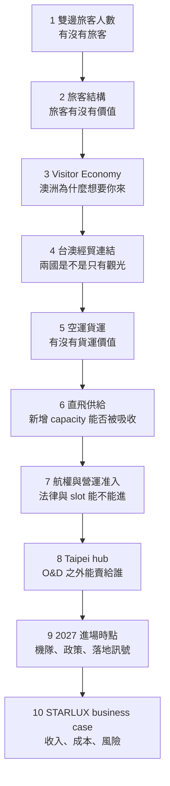

# 星宇航空進入澳洲：專題報告論證架構與資料來源

**更新日期：2026 年 9 月 21 日**（原版本：2026 年 9 月 18 日）

> **2026-09-21 更新紀錄**（本輪以 BITRE 與 ABS 官方原始檔補資料缺口；原始檔與整理見 `reference/data/`，口徑說明見 `reference/data/README_台澳貨運量_BITRE.md`）
> - 第一章：補上 ABS Table 5 的台灣居民赴澳月資料；**推翻先前「需求放緩」的判斷**——放緩只出現在澳洲→台灣方向，台灣→澳洲 2026 H1 +15.3%。
> - 第二章：簽證改革影響範圍校準——「停留 31 晚以上占 29%」中打工度假／境內轉簽占多少，TRA 未拆分。
> - 第五章：補上 BITRE 台澳貨運量（2025 年台澳合計 15,887 噸，雪梨—台北 3,621 噸，為三航點最少）。
> - 第六章：載客率改用 BITRE 雙向實測（FY25/26 為 88%），確認舊圖 79% 是入境單方向；補上雪梨單線座位與載客率，以及新增運力的情境算術。
> - 第八章、第十章：補直飛方向性實測、修正載客率 benchmark、更新風險表與待查清單。
> - 已處理：風險清單分類、開航促銷移出主文、s1／s2／s6 重複說明縮減；其餘章節仍可繼續做章內減法（見 QA 檔）。

## 核心問題與故事主線

報告要回答一個核心問題：

> 星宇 2027 進入雪梨，是單純押注旅遊復甦，還是 Taiwan–Australia 已形成足以支撐長程航線的 economic corridor？

故事順序採「先建市場、最後才進公司」：前五章證明需求是否存在、有沒有結構、有沒有經貿基礎；第六到八章證明新進者進得去；第九章解釋為什麼是現在；第十章才談星宇本身。每一章結尾只給一個結論句，下一章接著問「那然後呢」。

方法上守住一個原則：先從市場資料往下驗證，最後才判斷星宇進場合不合理；不是先認定航線會成功，再回頭找數字佐證。



讀法：前半段是市場論證，後半段是航空公司論證；兩段中間的樞紐是第六章的「需求成長、直飛供給收縮、載客率回升」。

---

## 第一章 雙邊旅客人數：需求存在，而且 2025 明顯成長

**這章要說的一句話**：2025 年有 193,490 名台灣居民進入澳洲，年增 18%，成長率高於澳洲整體國際旅客；反向來看，交通部觀光署「按居住地」統計顯示 125,288 名居住於澳洲的旅客來台，年增 11.32%。兩邊都是「目的地國官方入境統計」，較接近對稱的 destination-country comparison，算出約 1.54:1；但澳洲用 TRA/ABS/IVS 體系、台灣用觀光署自己的入境統計，不是完全相同的統計系統，這個 1.54:1 是算術正確但統計方法不完全一致下的近似對照。TRA 另有一組 85,080 的數字，但那是澳洲自己統計的「Australians visiting Taiwan」，不是台灣官方的入境數，兩者資料來源與統計方法不同，不應直接視為同一口徑混用。

**論證步驟**

1. 先放 Tourism Research Australia（TRA）的 193,490、+18%。這是澳洲端實際入境市場的資料。
2. 再放交通部觀光署的「首站」統計：2025 年澳洲 160,328 人次，約 +7.5% YoY。
3. 澳洲官方 193,490 比台灣首站統計 160,328 高 33,162 人，約高 20.7%。這個差異不能直接說成「都是轉機客」，因為兩邊統計母體、定義與資料來源不同。
4. 台灣觀光署的 2013–2025 首站序列可用來畫長期趨勢：2018 年 190,163、2019 年 180,048、疫情期間大幅下降、2025 年 160,328。以台灣「首站」口徑來看，2025 仍低於 2019。
5. 澳洲端 2025 實際值為 193,490。是否已超越 2018、2019 疫情前高點，需另取 ABS / TRA 同口徑 historical actual arrivals 確認（2026-09-21 已由 ABS Table 5 補上：2018 年 202,820、2019 年 194,610、2025 年 193,490，2025 較 2019 -0.6%，大致回到疫情前水準，未超越）。不使用 TRA 的 Forecast visitor growth 圖來做歷史實際值比較（該圖標題本身是預測圖，圖上 2025 的點跟第 0 頁公布的實際值不一致）。
6. TRA 預測 2030 年台灣訪澳旅客約 236,000，可作為長期市場展望，不與 actual 混用。
7. 比較兩邊的目的地國官方入境統計：193,490（澳洲入境的台灣居民）對 125,288（台灣入境、居住地為澳洲的旅客，交通部觀光署 2025），約為 1.54:1。這個比例證明的是「resident visitor flow 不對稱」——193,490 是 Taiwan-resident visitors to Australia，125,288 是 Australia-resident visitors to Taiwan，兩者都是「居住地」統計，不是 ticket point-of-sale 資料，也不是 SYD–TPE 這條航線的 O&D 資料；它不能證明航班去回程載客失衡，因為同一名旅客去程回程通常都會搭，兩個方向各貢獻一個 segment。要證明 directional imbalance 得用 BITRE city-pair 按方向的旅客數或各方向載客率。這個比例本身不是這份報告的重點，route economics 真正要看的是 SYD–TPE 的實際 passenger segments、O&D、轉機客、票價與艙位供給，這句留給第八章接。（2026-09-21 補：BITRE 雪梨—台北直飛實測，2025 年台北→雪梨 64,553 人、雪梨→台北 68,070 人，兩方向約 1:1；2019 年為 106,327 對 111,982。這是該航段實際載客，含在台北轉機到第三地的旅客，因此不是台灣居民赴澳的 O&D，也不含經香港、新加坡等其他樞紐飛的旅客。）

補一個歷史序列（交通部觀光署「按居住地分」，2018–2025）：

| 年 | 澳洲居住旅客來臺 | 紐西蘭居住旅客來臺 |
| --- | ---: | ---: |
| 2018 | 102,541 | 16,362 |
| 2019 | 111,788 | 19,831 |
| 2020 | 18,906 | 3,093 |
| 2021 | 568 | 159 |
| 2022 | 11,509 | 2,792 |
| 2023 | 87,288 | 15,040 |
| 2024 | 112,547 | 17,053 |
| 2025 | 125,288 | 18,242 |

值得注意的反差：**澳洲 2025（125,288）已經超過 2019 疫情前高點（111,788）約 12%**，但**紐西蘭 2025（18,242）還沒回到 2019 高點（19,831）**，落後約 8%。這跟第一章前段「台灣→澳洲方向 2025 仍低於 2019」的結論方向相反——這是兩個不同方向、不同市場的復甦速度，不能混為一談。2022 年約 +1,900% 的 YoY 主要受極低基期與邊境重新開放影響，因此不宜把百分比本身解讀成正常市場成長率。18,242 衡量的是 New Zealand → Taiwan visitor market（紐西蘭居民來台），不是 Sydney ↔ Auckland 的 Trans-Tasman O&D，**不能拿它去推論 SYD–AKL 延伸段的市場規模**——這是完全不同的市場問題，真正要查的是 BITRE 的 Auckland–Sydney city-pair passenger 資料。

**2026 上半年（H1）最新查證**：直接操作交通部觀光署《觀光統計資料庫》查詢介面，篩「居住地：澳洲」「115 年（2026）1 月至 6 月」，查得 **64,563 人次**（1 月 14,626、2 月 8,013、3 月 12,384、4 月 13,767、5 月 7,901、6 月 7,872）；同口徑查 114 年（2025）同期為 **63,024 人次**。兩者相比 **YoY 約 +2.4%**，明顯比 2025 全年 +11.32% 的成長率慢下來很多——是值得留意的減速訊號，但只是一個半年度快照，還不能判斷是短期波動還是趨勢轉折，需要後續季度資料驗證是否持續。

正向（台灣居民赴澳，即 193,490 那個方向）**已補齊（2026-09-21）**：下載 ABS《Overseas Arrivals and Departures, Australia》2026 年 7 月號 Table 5（Short-term Movement, Visitors Arriving – Selected Countries of Residence: Original，檔案 `340105.xlsx`），台灣居民短期入境為：2018 年 202,820、2019 年 194,610、2023 年 122,790、2024 年 164,470、2025 年 193,490（與 TRA 引用數字一致；較 2024 +17.6%，較 2019 -0.6%）。**2026 年 1–6 月 101,020 人次，較 2025 同期 87,600 成長約 15.3%**；1–7 月 124,930，較 2025 同期 111,260 成長約 12.3%。單月：1 月 -19.0%、2 月 +84.9%、3 月 +16.6%、4 月 +17.9%、5 月 +5.4%、6 月 -6.7%、7 月 +1.1%；1、2 月的大幅反向波動可能主要受春節落點不同影響（2025 年在 1 月底、2026 年在 2 月中；這是合理解釋，未用其他資料驗證），不應把單月當趨勢。因此**放緩只出現在澳洲→台灣方向（H1 +2.4%），台灣→澳洲方向沒有放緩**。班機端與此一致：BITRE 台澳直飛載客（三個航點城市對合計）2026 上半年較去年同期約 +11%（國家層級表含延伸航段旅客約 +12%），雪梨—台北約 +13%。先前版本（9 月 18 日）曾寫「只查到 7 月單月 +1.06%，也是放緩」，那是把單月當趨勢的過度解讀，已更正。另外要修正一個先前查證時的誤讀：ABS 頁面上「Excludes SARs and Taiwan」這句但書，只適用於敘述性的「三大來源國」排名句子（New Zealand / China / USA），不是說整份資料排除台灣——Table 5 本身確實有台灣欄位，逐月都有數字，不應誤解成 ABS 不公布台灣資料。

**要避免的錯**

- 不要說「193,490 − 160,328 的差額全部是轉機旅客」。
- 不要把 193,490 說成 Sydney–Taipei route passengers；這是全澳洲 Taiwan resident visitor market。
- 不要用 1.54:1（或 TRA 的 85,080）推論「回程填不滿」。
- 不要拿 TRA forecast chart 上的 2025 點與 2018 / 2019 actual 直接比較。
- 不要把 ABS 頁面「Excludes SARs and Taiwan」這句但書誤讀成「ABS 不公布台灣資料」；那句只限定敘述性排名句，資料表本身有台灣。
- 不要把 ABS 2026 年 7 月單月數字（23,910）當成 H1 累計或年度數字使用。
- 不要把單月變化（如 7 月 +1.1%）當成趨勢；春節落點可能造成 1、2 月劇烈反向波動（推論）。

**資料來源**

| 數據 | 來源 | 口徑 / 備註 |
|---|---|---|
| 193,490 訪客、+18%、236,000 預測、85,080 反向 | [TRA Taiwan Visitor Economy Profile 2025](https://www.tra.gov.au/content/dam/austrade-assets/global/wip/tra/documents/market-profiles/tra-market-profiles-taiwan-2025.pdf) | 澳洲端 visitor market；2026 年 3 月更新 |
| 2013–2025 澳洲首站序列、2025 = 160,328 | 交通部觀光署「中華民國國民出國按目的地」 | 飛航到達首站 |
| 澳洲整體 international visitors +8%（對照） | [TRA International tourism results – Dec 2025](https://www.tra.gov.au/en/tourism-statistics/international-tourism-results/international-tourism-results-december-2025) | 年度資料 |
| 125,288 反向、+11.32%、2018–2025 澳紐序列 | 交通部觀光署《觀光統計資料庫》[來臺旅客按居住地分](https://stat.taiwan.net.tw/inboundSearch) | 台灣官方入境統計，按居住地 |
| 台灣居民赴澳月資料：2026 H1 101,020（2025 同期 87,600，+15.3%）；1–7 月 124,930（+12.3%）；2019 年 194,610、2025 年 193,490 | [ABS Overseas Arrivals and Departures, July 2026, Table 5（340105.xlsx）](https://www.abs.gov.au/statistics/industry/tourism-and-transport/overseas-arrivals-and-departures-australia/latest-release)（2026-09-21 下載，已存 `reference/data/`） | 已驗證，Original 序列，按居住國分的短期訪客入境 |
| 2026 H1（1–6月）澳洲居住旅客來臺 64,563（2025 同期 63,024，+2.4%） | 交通部觀光署《觀光統計資料庫》[來臺資料查詢](https://stat.taiwan.net.tw/inboundSearch)（本輪實際操作查詢介面查得，2026-09-19 擷取） | 已驗證，親自查詢 |
| ABS 2026年7月台灣訪澳 23,910（2025年7月 23,660，+1.06%），單月數字 | [ABS, Overseas Arrivals and Departures, Australia, July 2026](https://www.abs.gov.au/statistics/industry/tourism-and-transport/overseas-arrivals-and-departures-australia/latest-release) | 已驗證；H1 累計需下載 Table 5 Excel，待查 |

---

## 第二章 旅客結構與目的：需求有結構，不完全依賴首次訪客

**這章要說的一句話**：台灣赴澳旅客 67% 為 Holiday（澳洲國際旅客平均約 43%）、29% 停留 31 晚以上、56% 為重遊客，顯示市場有一定 repeat visitation 基礎，且旅遊停留結構偏長。

**論證步驟**

1. 旅行目的：Holiday 67%、VFR 18%、Education 5%、Employment 5%、Business 2%。與澳洲整體國際旅客相比，台灣市場明顯偏 leisure。
2. 將 purpose 翻成航空需求語言時要保守：Holiday 季節性、票價敏感度與托運行李需求可能較高；VFR 可能形成假期集中與重複往返需求；Education 長停留，且可能衍生家屬探親；Business 台灣居民赴澳旅客中的 business-purpose share 只有 2%，表示不能只靠台灣端商務旅行需求支撐 premium cabin。
3. Travel purpose 不等於 cabin class。Business 2% 不代表 Business Class 需求只有 2%；premium demand 仍可能來自高消費 leisure、VFR、Australia-origin passengers、transfer traffic 等。
4. 停留天數：1–7 晚 25%、8–14 晚 32%、15–30 晚 14%、31 晚以上 29%。因此可寫「約三成旅客停留 31 晚以上」。較長停留通常有利於累積較高的 trip expenditure，但不要直接把它寫成特定人均消費水準的因果證明。
5. 目的地分布：96% 造訪 capital cities / Gold Coast；Victoria 48%、NSW 46%、Queensland 38%。州別可重複計算，不能加總成 100%。這種多州、多城市的分布，與目前台澳直飛航線分布在雪梨、墨爾本、布里斯本的市場結構相符，但不足以說是因果——這只是相符關係，不是「因為 NSW 46% 所以華航才飛雪梨」的證明。
6. 回訪 56%、首次 44%、positive evaluation 96%。重點是市場不是完全依賴 first-time visitors。
7. 澳洲移民部長 Tony Burke 於 2026-09-17 在全國記者俱樂部發表移民改革演說，有兩項改變都直接指向壓縮運量，要一起看，不要只挑一項講。第一，打工度假簽證（417/462）第二年名額從 57,000 砍到 45,000（約 -21%）、第三年名額從 31,000 砍到 5,000（約 -84%），改用抽籤制，且第二年需先完成 88 天偏鄉工作、第三年需 6 個月偏鄉工作才具抽籤資格；只有英國因自由貿易協定豁免偏鄉工作要求。這跟本章「31 晚以上停留占 29%」這個族群有直接關係：打工度假是長天數停留的重要組成之一，續簽名額大砍，合理推論會壓縮部分旅客把停留拉長到數月甚至一年以上的意願。第二，所有新發出的觀光簽證一律加註「不得境內續留」，正面封堵「visa hopping」——過去旅客可以先用觀光簽證入境，再就地申請轉成打工度假、學生簽證等其他類別，等於不用額外訂機票就能把停留無限期延長；這條路徑現在被封死，想繼續留在澳洲的人必須先出境、再從境外重新申請，等於少了一種延長停留的管道。這兩項改變方向一致：都讓「留久一點」變難，都可能壓縮長天數、高消費力旅客對運量的貢獻，不應該只把打工度假名額大砍當成唯一的變數，境內轉簽被封堵同樣值得放進來看。公告內容沒有特別提到台灣，代表台灣申請人適用一般規則，沒有豁免；第一年（初次入境）打工度假簽證名額本身未受影響，只有續簽第二、三年被大砍。
8. 要老實校準第 7 點的規模，不要看到政策就直接推論成「需求大跌」。台灣旅客有 67% 是純度假、本來就買好來回機票，不太會用到打工度假或境內轉簽這兩條路，不受這次改革直接影響；真正被打到的是長天數、打工度假、境內轉簽身分交疊的族群，只是整體的一小部分。所以方向是需求會降低沒錯，但力道不應該被誇大成「重大衝擊」——政策本身已證實、方向合理，但對台澳這條航線需求的實際量化衝擊有多大，目前沒有航線層級數據可以驗證，只能標成推論。（2026-09-21 補：第 7 點說這兩項「直接影響 31 晚以上占 29% 的族群」需保守——這 29% 中有多少是打工度假或境內轉簽，TRA 未拆分，其餘可能是留學、探親等，目前無法得知；頁面已據此改寫，並把原本兩個重複的 box 合併為一個。）

**要避免的錯**

- 不要把 Business 2% 直接等同 Business Class demand 弱。
- 不要寫「商務艙要靠轉機客補」當成已證實結論；這仍需 cabin / fare / point-of-sale 資料。
- 不要把 NSW 46% 直接當成 Sydney Airport market share。
- 不要把打工度假簽證改革寫成「針對台灣」或「已證實會減少雪梨航線需求」——政策是全球性的，對這條航線的量化衝擊仍是推論，且第一年簽證本身沒有被砍。

**資料來源**

| 數據 | 來源 |
|---|---|
| 旅行目的、停留天數、州別分布、重遊率、正面評價 | [TRA Taiwan Visitor Economy Profile 2025](https://www.tra.gov.au/content/dam/austrade-assets/global/wip/tra/documents/market-profiles/tra-market-profiles-taiwan-2025.pdf) |
| 2026-09-17 移民改革演說：打工度假簽證第二、三年名額與抽籤制 | [ABC News, Labor tightens visa rules as Tony Burke vows migration targets will be met](https://www.abc.net.au/news/2026-09-17/labor-immigration-crackdown-students-backpackers-overstay-visa/107164354)、[ABC News, Federal politics: Government's migration policy unveiled by Tony Burke](https://www.abc.net.au/news/2026-09-17/federal-politics-live-blog-sept-17/107161304) |
| 打工度假簽證費用調漲（2026-07-01 生效，第一次 A$670→A$840、第二三次 A$670→A$1,000） | [solmigration.com, Working Holiday Visa (417/462) Changes From 1 July 2026](https://www.solmigration.com/blog/australia-working-holiday-visa-417-462-changes/) |

---

## 第三章 澳洲端誘因：為什麼 NSW 與 Sydney Airport 會重視台灣市場

**這章要說的一句話**：2025 年台灣市場在澳洲產生 A$977.8m visitor spend；同時 Sydney / NSW international tourism 與 Sydney Airport international traffic 均處在高水準。從政府與機場角度，新增台灣航空 capacity 有招商價值，但 visitor spend 不等於航空公司 route revenue。

**這章的定位**

這章是「政府 / Destination / Airport 視角」，不是「Airline P&L 視角」。旅客在澳洲花多少錢，能解釋為什麼 Destination NSW 想增加 inbound capacity、為什麼 Sydney Airport 願意招商新航線、為什麼政府會設計 Take-Off Fund。但它不能直接證明星宇航線有利潤。

**論證步驟**

1. Taiwan visitor market：TRA 公布 A$977.8m total spend、+8% YoY、average visitor spend A$5,589。
2. 注意：A$977.8m ÷ 193,490 ≈ A$5,053，與官方 average visitor spend A$5,589 不一致；TRA 這份 Profile 確實列出 IVS、ABS 等多個資料來源，但沒有在頁面上明確解釋這個落差的原因，可能與不同資料來源、survey weighting 或 measure definition 有關，官方未說明，所以不要自行相除去解讀差異。
3. 因此不能用「visitors +18%、spend +8%」直接推導「人均消費下降」。若要看人均 spend trend，必須取得 2024 與 2025 同一 spending measure 的 average visitor spend。
4. 反向（澳洲、紐西蘭居民在台灣的消費）目前查不到同等精細的官方數字，這是明確的資料缺口，不是疏漏：交通部觀光署 2025 官方《來臺旅客消費及動向調查》35 頁摘要公布了全體來臺旅客的平均消費（8,574,547 人次、US$11.033b、日均 US$185.14、每次 US$1,287）與市場別支出表（表 15、16），但這張市場別支出表只列新南向主力 7 國、美國、日本、港澳、歐洲、韓國、大陸七個市場，沒有把澳洲或紐西蘭單獨列出來。另一份官方新聞稿則提到「紐澳來臺旅客**人次**達疫情前（108 年）的 109.05%」——這是紐澳合計的人次恢復率，不是消費金額或消費恢復率，而且是「紐澳合計」，不能拆開推成「澳洲、紐西蘭兩國各自都超過 2019」；事實上第一章已經算出澳洲 2025（125,288）已超過 2019、紐西蘭 2025（18,242）還沒回到 2019，兩國復甦速度不一樣，109.05% 只是加總後的平均。所以目前不能用公開資料估算 Australia-resident visitors 在台灣的單獨總消費或人均消費，也不要把 109.05% 當成消費恢復率使用，或用它反推澳洲單獨的消費金額。完整官方報告是否有附錄拆出澳洲、紐西蘭的市場別消費，目前沒有查到，列入待查清單。
5. Sydney 與 NSW 要分開：Sydney YE March 2026：3.9m international visitors、89.9m nights、A$13.9b spend；前一年 Sydney：3.6m visitors、84.5m nights、A$12.2b spend。NSW YE March 2026：4.2m international visitors、+7.9%；107.8m nights；A$15.2b spend、+18.1%。
6. Sydney Airport：2025 全年 42.54m passengers、+2.7%；T1 international 17.17m，創歷史高點。2026 Q1 international 4.57m、+5.8%；H1 international 8.44m、+2.1%。Q2 total traffic -0.7%，所以描述應為「整體仍具成長趨勢，但季度有波動」。
7. NSW Take-Off Fund：Taiwan 列 priority market；新 route 至少 weekly 3 services；官方原文是「the additional capacity must commence prior to 30 June 2027」，即新增運能必須在 2027-06-30 前開始（Fund 也支援既有航線擴班，不完全等於「開航」，但星宇本身是全新航線，這裡用「開航」不算錯）；applicant 是 NSW airport；最高補助 A$12.5m 且需 cash matching。星宇 2026 年 6 月宣布、預計 2027 年開航，市場、班次數與年份條件高度重疊，但正式首航日期截至目前仍未公布，因此還不能確認是否真的落在 2027 年 6 月 30 日前。
8. 這些條件與 STARLUX「Taiwan / Sydney / 2027 / 4–5 weekly」高度重疊，但目前沒有證據顯示 STARLUX 獲得補助，也沒有證據顯示 Sydney Airport 曾以 STARLUX 申請該 Fund。
9. Sydney Airport 在 2026 Q2 operational update 將 STARLUX 2027 entry 列為 connectivity development，可證明機場端把這條航線視為重要新增連結。

**要避免的錯**

- 不要把 A$977.8m 當成 airline revenue。
- 不要用 +18% visitors vs +8% spend 直接推論 per-capita spend 下滑。
- 不要用「紐澳合併恢復率 109%」反推澳洲單獨的消費金額。
- 不要寫「STARLUX 因 Take-Off Fund 才選 2027」。
- 不要寫「STARLUX 已獲 NSW 補助」，除非取得官方公告。

**資料來源**

| 數據 | 來源 | 狀態 |
|---|---|---|
| Taiwan visitor spend A$977.8m、+8%、average A$5,589 | [TRA Taiwan Visitor Economy Profile 2025](https://www.tra.gov.au/content/dam/austrade-assets/global/wip/tra/documents/market-profiles/tra-market-profiles-taiwan-2025.pdf) | 已驗證 |
| Sydney YE Mar 2026 / prior year | [Destination NSW Sydney statistics](https://www.destinationnsw.com.au/insights/sydney-statistics) | 已驗證 |
| NSW YE Mar 2026 | [Destination NSW International statistics](https://www.destinationnsw.com.au/insights/international-statistics) | 已驗證 |
| Take-Off Fund 條件 | [Destination NSW Take-Off Fund](https://www.destinationnsw.com.au/destination-nsw-business-support/grants-and-funding/take-off-fund-2025) | 已驗證 |
| Sydney Airport 2025 / 2026 Q1 / Q2 | [Q4 2025](https://www.sydneyairport.com.au/corporate/media/corporate-newsroom/sydney-airport-traffic-and-operational-performance-q4-2025)、[Q1 2026](https://www.sydneyairport.com.au/corporate/media/corporate-newsroom/sydney-airport-traffic-and-operational-performance-q1-2026)、[Q2 2026](https://www.sydneyairport.com.au/corporate/media/corporate-newsroom/sydney-airport-traffic-and-operational-performance-q2-2026) | 已驗證 |
| 澳洲整體 international spend A$39.2b、+19% | [TRA Dec 2025](https://www.tra.gov.au/en/tourism-statistics/international-tourism-results/international-tourism-results-december-2025) | 已有 |
| 紐澳 109.05% 人次恢復率 | 交通部觀光署官方新聞稿[《114年來臺旅客觀光支出110億美元 五大趨勢驅動臺灣觀光由規模成長邁向產值提升》](https://admin.taiwan.net.tw/News/NewsTravel?a=35&id=36110)（115-08-03 發布） | 已驗證，非媒體轉載 |
| 市場別支出表（表15、16、19、20）未單列澳洲、紐西蘭 | 交通部觀光署《中華民國114年來臺旅客消費及動向調查》[35 頁官方摘要 PDF](https://admin.taiwan.net.tw/fapi/AttFile?id=41764&type=NewsAttFile) | 已驗證 |

---

## 第四章 台澳經貿連結：兩國不是只有觀光

**這章要說的一句話**：2025 年台澳雙邊 goods + services trade 約 A$27.9b；台灣是澳洲第 14 大雙邊貿易夥伴、第 9 大出口市場。再加上投資、教育與旅遊，Taiwan–Australia 的 economic linkage 並非單一觀光市場。

**2025 經貿基準表（DFAT 口徑）**

| 項目 | 2025 | 備註 |
|---|---:|---|
| 雙邊 goods + services trade | A$27.9b | 台灣為澳洲第 14 大雙邊貿易夥伴 |
| 澳洲對台 goods + services exports | A$17.5b | 台灣為澳洲第 9 大出口市場 |
| 澳洲自台 merchandise imports | A$9.4b | 主要包括 refined petroleum、telecom equipment、computers 等 |
| 雙邊 services trade | A$3.0b | 澳洲出口 A$2.1b、進口 A$996m |
| 台灣在澳 investment stock | A$20b | 較 2024 年下降 15% |
| 澳洲在台 investment stock | A$39.2b | 台灣為澳洲第 17 大 outward investment destination |
| 台灣留學生 | 11,792 | 澳洲為台灣重要留學目的地 |

**論證步驟**

1. 台灣端資料可補充經濟部國際貿易署 2025 台澳雙邊貿易約 US$17.3b。
2. DFAT 與台灣貿易署數字不能直接互相比較：幣別不同，且 goods / services 統計口徑不同。
3. 拆商品結構的意義：DFAT 資料顯示以 2024 年能源供應結構看，澳洲供應台灣近半的煤炭及 38% 的天然氣（這是 2024 energy context，不是 2025 trade-year 數據），這類 bulk commodities 主要不是航空貨運的目標市場，因此不能拿這些龐大的貿易額直接證明空運貨量大。真正能支撐 belly cargo 的，是高價、時效敏感、冷鏈或高 value-to-weight 的商品（例如生鮮、藥品、半導體零組件），這部分要留到第五章用真正的 air freight 數據確認。
4. 實際 air freight commodity mix 要留到第五章，以 BITRE / ABS / 台灣海關或民航資料確認。
5. Services trade A$3.0b 與 11,792 名留學生，與航空 passenger demand 的關係較直接：education、tourism、VFR 都可能形成持續跨境流動。
6. 本章收尾應寫：Taiwan–Australia 關係由 Tourism + Trade + Services + Investment + Education 多層構成；這證明 economic corridor 的「連結深度」，但不直接證明某一條航線一定獲利。

**要避免的錯**

- 不要把 A$27.9b 和 US$17.3b 相加、相減或直接比較成長率。
- 不要拿 LNG、煤、鐵礦砂的貿易額直接當空運需求證據，這類大宗商品主要不是空運的目標市場。

**資料來源**

| 數據 | 來源 | 狀態 |
|---|---|---|
| DFAT 全部數字 | [DFAT Australia-Taiwan relationship](https://www.dfat.gov.au/geo/taiwan/australia-taiwan-relationship) | 已驗證 |
| US$17.3b | [經濟部國際貿易署 Bilateral Trade](https://www.trade.gov.tw/english/Pages/Detail.aspx?nodeID=4639&pid=743482) | 沿用未重開 |

---

## 第五章 空運貨運需求：這條航線不只載人

**這章要說的一句話**：星宇在雪梨機場同時徵 Station Manager 與 Cargo Manager，可以證明澳洲 branch 的 launch planning 包含 cargo operations，但不能單靠這個職缺推出 SYD 航線的貨運營收貢獻有多大。星宇 2025 年報倒是能證明貨運對公司整體很重要：2025 年 cargo revenue 約 NT$4.95b、占總營收 11.2%、年增 57.1%。要證明的是「台澳之間有多少貨適合走空運」，不是「台澳貿易額有多大」。

**2026-09-21 更新：BITRE 台澳貨運量已取得**（BITRE International airline activity 時間序列，截至 2026 年 6 月；單位公噸，按城市對與方向；口徑是定期國際航空公司載運，不是台澳貿易中適合空運的貨量，BITRE 表格也未說明是否含全貨機）：台澳合計 2019 年 19,644、2024 年 16,732、2025 年 15,887（較 2019 -19%）；雪梨—台北 2019 年 9,313、2023 年 5,803、2024 年 4,599、2025 年 3,621（約為 2019 年的 39%；台灣→澳洲 2,375、澳洲→台灣 1,247）；2025 年三個航點：布里斯本 6,841、墨爾本 5,425、雪梨 3,621（最少）；2026 年 1–6 月台澳合計 8,483（較 2025 同期 +19%），雪梨 1,919（+4%）。**判讀**：目前數字不支持把貨運當成雪梨線的重要收入來源，但也不能就此排除（星宇帶來新增貨艙，價格與貨物結構可能不同）；雪梨貨量下降的原因（如長榮退出）沒有拆分資料，不能歸因。仍缺：貨物品項（BITRE 只有噸數）、2026 年 7–8 月（BITRE 最新到 6 月）、星宇 A330neo 實際可售貨艙。

**論證步驟**

1. 台澳雙邊空運貨量（噸）與貨值，最近三到五年序列。
2. 空運主要品項。澳洲出口端推論是龍蝦、牛肉、車厘子、藥品等高值生鮮與冷鏈；台灣出口端推論是半導體零組件與電子產品。這些是推論，要用資料證實。
3. 現有 SYD–TPE 航線的貨運 capacity 與載貨率。
4. 先確認 STARLUX A330-900 的 lower-deck configuration、usable cargo volume / LD3 positions，再評估 passenger baggage、fuel、route distance、weather 與 payload restriction 後的實際可售貨運能力；不要直接把 Airbus nominal cargo volume 換算成固定的每週貨運噸數。

**要避免的錯**

- 不要拿 LNG、煤、鐵礦砂的貿易額直接當空運需求證據，這類大宗商品主要不是空運的目標市場。
- 不要把「總貿易額成長」直接推成「空運需求成長」。

**去哪找**

| 資料 | 來源 | 狀態 |
|---|---|---|
| 澳洲國際航空貨運，按航線與航空公司 | BITRE International Airline Activity（月報有 freight by route） | 噸數已取得（2026-09-21，見上方更新）；品項仍待查 |
| 澳洲進出口按運輸模式 | ABS International Merchandise Trade（可篩 air） | 待查 |
| 台灣空運貨物統計 | 民航局統計、財政部關務署進出口統計 | 待查 |
| Cargo Manager 職缺內容 | [SEEK Cargo Manager, Mascot](https://au.seek.com/job/94191210) | 已有，需截圖存檔，職缺會下架 |
| A330neo lower-deck configuration / cargo positions | [Airbus A330-900 官方規格](https://www.aircraft.airbus.com/en/aircraft/a330/a330-900)（maximum cargo configuration：11 pallets 或 33 LD3；實際可售貨運重量仍受 passenger baggage、fuel、route distance 與 payload constraints 影響） | 待查 STARLUX 實際 lower-deck 配置與可售 payload |
| 商品結構（哪些走海運） | 第四章 DFAT 資料 | 已有 |
| 星宇 2025 cargo revenue NT$4.95362b、占 11.24%、YoY +57.1% | [星宇航空 2025 年度年報](https://webassets2.starlux-airlines.com/en-TW/Images/260508-%E6%98%9F%E5%AE%87%E8%88%AA%E7%A9%BA2025%E5%B9%B4%E5%BA%A6%E5%B9%B4%E5%A0%B1%28%E8%8B%B1%E6%96%87%E7%89%88%29-V2_tcm14-15751.pdf)（同一份也用在第九章） | 已驗證 |

---

## 第六章 直飛供給：capacity 收縮、載客率回升，值得檢驗新增運能的吸收力

**這章要說的一句話**：台澳直飛 capacity 在 FY2024-25 收縮，載客率從 FY2023-24 的 76% 回升到 79%；同期赴澳台灣旅客持續增加，顯示市場值得進一步檢驗新增直飛運能的吸收能力。先不要寫「座位不夠」，等實際座位數與 BITRE 直飛旅客數算出來再判斷。

這章是整份報告的樞紐。前五章證明有需求，這章檢驗現有供給接不接得住，後面的章節才有存在的理由。注意兩組資料口徑不同：193,490、+18% 是 2025 曆年、含轉機的全部台灣旅客；79% 是 FY2024-25、只算直飛 capacity。不能直接相除。

**2026-09-21 更新：BITRE 實測取代本章初步判斷**（原始檔在 `reference/data/`；旅客數來自城市對檔，座位來自 CityPairs 工作表，雪梨—台北座位為獨占可直接使用；載客率＝旅客 ÷ 座位）

- **舊圖是入境單方向**：TRA 圖的十年載客率（81、79、76、76、73、7、16、66、76、79）與 BITRE 算出的入境方向（台灣→澳洲）載客率逐年吻合。雙向合計：FY15/16 82%、FY18/19 78%、FY23/24 77%、FY24/25 82%、**FY25/26 88%**（2025 年 7 月至 2026 年 6 月）。
- **台灣全澳洲單向座位**：FY18/19 369,527 → FY24/25 278,074（約 -25%）→ FY25/26 291,662。
- **雪梨—台北直飛**：單向座位 2019 年 146,268、2024 年 89,973、2025 年 78,603（約 -46%）；2026 年 1–6 月 39,556（與 2025 同期 38,251 大致持平）。雙向載客率 2019 年 74.7%、2025 年 84.4%、2026 年 1–6 月 88.9%；2025–2026 年多個單月單向達 92–100%。兩方向旅客約 1:1。
- **情境算術（非預測；頁面已改以堆疊圖呈現，2026-09-21）**：華航 NW26 起雪梨每日（7 班／週），若每班座位等於 2025 年平均（約 308 席；2025 年 255 班、78,603 席），全年單向約 112,000 席，較 2025 增約 33,600；星宇每週 4–5 班（297 席）增 61,776–77,220。合計單向約 174,000–190,000 席，高於 2019 年的 146,268。維持 80% 載客率需單向約 14–15 萬旅客，2025 年實際為 64,553（入）／68,070（出）。（頁面已改用第十章的需求情境表達，不再使用 80% 門檻。）假設：華航全年 7 班／週、座位同 2025 平均、星宇全年營運；實際班表與機型配置未定。
- **對本章敘事的影響**：「供給縮小、載客率回升」有數據支撐，且比 79% 更強；真正的問題是新增座位能否從轉機客（國泰、新航）或成長中的需求吸收，不是現有座位夠不夠。
- **限制**：BITRE 只有直飛，不含經香港、新加坡等其他樞紐的旅客；載客率不等於獲利；無票價。華航旅客數含經澳洲過境（如布里斯本—奧克蘭）旅客（BITRE 為算座位使用率而納入），台灣全澳洲數字受此影響；雪梨—台北城市對旅客是該航段實際載客，含在台北轉機到第三地的旅客。國家層級統計按同班號服務的起訖國家分類，含同班號延伸航段旅客，不是純粹的台澳 O&D；雪梨單線數字（2025 年 84.4%、2026 H1 88.9%）更適合直接支撐雪梨航線論證。

**論證步驟**

1. 直接搬 TRA PDF 那張圖：FY15/16 到 FY24/25 的 seats available 與 load factor 雙軸。載客率序列大致是 81%、79%、76%、76%、73%，疫情期間 7%、16%，之後 66%、76%、79%。
2. 拆現有直飛供給：長榮雪梨、墨爾本航線已停飛（Wikipedia《List of EVA Air destinations》標示 Terminated），目前長榮在澳洲僅剩布里斯本，每週 3 班 787-10（2026-10-26 起班號由 BR315/316 改為 BR325/326，屬改班號不是停飛）。華航則在 2026 冬季班表（NW26）大幅加碼：台北—雪梨由每週 5 班增至每日（7 班/週，2026-10-25 生效）、台北—墨爾本由每週 4 班增至 5 班（2026-10-28 生效）、另新增台北—布里斯本不經奧克蘭的直飛 1 班/週（2026-10-26 生效，原有經奧克蘭掛班的 5 班/週布里斯本服務維持不變），全數使用 A350-900（306 席三艙或 331 席兩艙）。這代表雪梨這條城市對目前實質上只有華航一家在飛直飛，而且華航在星宇官方宣布進場（2026-06-02）之後隨即加碼運力——這個時間點的接近值得注意，但目前無法判斷是「市場成長快到連在位者都要加班」還是「華航防禦性卡位」，兩種解讀都要列，不能只採信一種。精確座位數與艙位配置仍待查 2026 年冬季班表細節。
3. 拆間接供給：國泰經香港、新航經新加坡、日系經東京的轉機選項。星宇搶的很可能是這些轉機客，不只是華航直飛客，所以間接供給要算進來。其中國泰是目前規模最大的間接供給者：雪梨是國泰在澳洲最熱門的航點（2026 Q1 從香港出發 351 班次，領先墨爾本 265、伯斯 172、布里斯本 168），換算約每週 27 班（接近每天 4 班），量級遠超星宇規劃的每週 4–5 班直飛。香港—台北目前更是國泰全公司運能最大的單一航線（雙向約 290 萬座位、年增 7%），顯示台灣出發旅客早已有成熟的「經香港轉機」使用習慣，星宇要爭取的不是一個陌生選項，而是一個既有、規模很大的行為模式。
4. BITRE 與 TRA 各管各的：BITRE 衡量直飛供給、passenger movements、city-pair、載客率；TRA 衡量台灣居民訪澳市場。兩者可以並列看「直飛供給 vs 總訪客需求」，但不要相除宣稱「多少比例台灣旅客搭直飛」。BITRE city-pair 是實際上下機點，SYD→TPE→東京的旅客會被算進 SYD–TPE；反過來 TPE→HKG→SYD 的台灣旅客 TRA 有算、BITRE 台澳直飛看不到。沒有 itinerary 或 residence-level 的航空資料就不能做那個比例。
5. 收尾：星宇預計每週 4 到 5 班起步、逐步加到每天一班，A330neo 297 席（28 商務、269 經濟）。以 **per direction** 計算：每週 4 班 = 1,188 seats/week、年化約 61,776 seats；每週 5 班 = 1,485 seats/week、年化約 77,220 seats；每日 = 2,079 seats/week、年化約 108,108 seats。若看雙向 seat segments，年化分別約 123,552、154,440、216,216，但報告主模型應優先使用 per-direction capacity，再與 BITRE 同口徑直飛座位數比較，避免把 one-way 與 round-trip capacity 混在一起。

**要避免的錯**

- 建模不要用 A350，星宇策略長已確認雪梨、奧克蘭用 A330neo。
- TRA 那張圖是「台灣市場」的 capacity，涵蓋全澳洲，不是只有雪梨。
- 不要寫「教科書式新進者訊號」、「現有供給接不住」，那是結論，證據還沒到。
- 不要把長榮算進雪梨這條線的現有競爭者——長榮雪梨、墨爾本航線已停飛，目前只剩布里斯本。
- 不要只挑一種解讀華航 2026 年 10 月加碼運力的原因（市場成長 vs 防禦性卡位），兩種都要列，現階段沒有證據可以排除另一種。

**資料來源**

| 數據 | 來源 | 狀態 |
|---|---|---|
| Capacity 與 load factor 十年序列 | [TRA Taiwan Visitor Economy Profile 2025](https://www.tra.gov.au/content/dam/austrade-assets/global/wip/tra/documents/market-profiles/tra-market-profiles-taiwan-2025.pdf)，原始資料是 BITRE Aviation Statistics | 已有 |
| 長榮雪梨、墨爾本已停飛，僅存布里斯本 | [Wikipedia, List of EVA Air destinations](https://en.wikipedia.org/wiki/List_of_EVA_Air_destinations) | 已驗證，維基百科整理，建議之後補官方時刻表交叉核對 |
| 長榮布里斯本 3 班/週、787-10，2026-10-26 起班號變更 | [AeroRoutes, EVA Air Brisbane Flight Number Changes From late-Oct 2026](https://www.aeroroutes.com/eng/260901-brnw26bne) | 已驗證 |
| 華航 NW26：雪梨 5→7 班/週（10/25）、墨爾本 4→5 班/週（10/28）、布里斯本新增不經奧克蘭直飛 1 班/週（10/26），全用 A350-900 | [AeroRoutes, China Airlines NW26 Australia Network Expansion](https://www.aeroroutes.com/eng/260624-cinw26au) | 已驗證 |
| 華航雪梨增至每日、A350-900 座位配置（306 席三艙或 331 席兩艙） | [2PAXfly, China Airlines: More flights to Australia from October 2026](https://www.2paxfly.com/2026/06/29/china-airlines-more-flights-to-australia-from-october-2026/) | 已驗證 |
| BITRE 台澳直飛旅客數、city-pair 按方向、座位、貨運 | [BITRE International airline activity 時間序列](https://www.bitre.gov.au/publications/ongoing/international_airline_activity-time_series)（2026-09-21 下載，截至 2026 年 6 月，已存 `reference/data/`） | 已驗證，見本章更新 |
| 星宇 4–5 班起步、A330neo | [Executive Traveller, Starlux locks in A330neo](https://www.executivetraveller.com/news/starlux-sydney-taipei-australia-taiwan-flights) | 已有，媒體引述高層說法，非官方班表 |
| A330neo 297 席、28 商務、269 經濟 | 星宇 2022 年 A330neo 交機新聞稿；多家媒體一致 | 已驗證 |

---

## 第七章 航權與營運准入：台澳 bilateral capacity 為 Open，SYD–AKL 第五航權與雪梨 slot 另行確認

**這章要說的一句話**：澳洲政府 Northern Summer 2026 表列台灣市場 capacity limit 為 Open，目前核准班表使用約 20 班（每方向每週），可用量 Unlimited；因此從目前公開的 capacity summary 看，台澳總量 capacity cap 不像是主要 binding constraint。但雪梨機場是 IATA Level 3 協調機場、每小時上限 80 架次、每日 1,360 架次，slot 仍須取得。紐西蘭與台灣之間已有 Open Skies framework，但 STARLUX 個別 licence，以及 Australia–Taiwan arrangement 是否允許 SYD–AKL 載 local traffic，仍要另外確認。

**論證步驟**

1. 台澳航權：澳洲基礎建設部 2026 年 4 月公布的 Growth Potential for Foreign Airlines 直接列 Taiwan: Open、In use 20 services、Available Unlimited。台澳航空安排自 1994 年 3 月 25 日起具 operational effect，屬 less-than-treaty-status arrangement。從目前公開的 NS26 capacity summary 看，Taiwan 的 bilateral capacity entitlement 為 Open，因此總量 capacity cap 看起來不是目前的 binding constraint；但實際 airline approval、route-specific traffic rights 與 airport slots 仍須分開確認，不能把「Open」理解成所有法規條件都已自動滿足。
2. 雪梨機場 slot：Sydney Airport Demand Management Act 1997 設每小時最多 80 架次、每日最多 1,360 架次，所有起降都要有 slot，由 ACL Asia Pacific 分配。官方說需求已明顯超過機場容量。星宇能拿到什麼時段的 slot 會直接影響轉機銜接品質，這是營運准入問題，跟航權分開。2024–2025 年的制度改革包含 provisions relating to new entrants，目的是改善新航空公司取得可用時段的機會，但這不代表新進者可以凌駕既有的 historic slots，拿到什麼時段仍未知。
3. SYD–AKL 延伸段：紐西蘭 Ministry of Transport 公開資料顯示，New Zealand 與 Taiwan 的 Separate Customs Territory 之間已有 Open Skies Air Transport Agreement，原則上不對 routes、capacity 或 traffic rights 設一般性限制；但外籍航空執飛紐西蘭定期國際航班仍須取得 scheduled international air services licence。對 STARLUX 而言，紐西蘭端的 bilateral framework 已較清楚，真正仍待釐清的是 STARLUX 個別 NZ licence，以及 Australia–Taiwan arrangement 是否允許台灣籍航空在 SYD–AKL 接載 local traffic。星宇策略長說這段預計單獨販售，Sydney Airport 官方則只確認 onward service to Auckland，因此在政府文件確認前，仍應標為待驗證的 fifth-freedom / local-traffic right。

**要避免的錯**

- 「轉機航權」這個詞不要用。航權是法律問題，轉機是網路問題，分屬第七章與第八章。
- 澳洲表格的 20 services 是「每方向每週」，不要寫成雙向或每月。

**資料來源**

| 資料 | 來源 | 狀態 |
|---|---|---|
| Taiwan: Open、20 services、Unlimited | [Growth Potential for Foreign Airlines, NS26](https://www.infrastructure.gov.au/sites/default/files/documents/ns26-growth-potential-foreign-airlines.pdf) | 已驗證 |
| Level 3、80 架次／小時、1,360 架次／日 | [Demand Management at Sydney Airport](https://www.infrastructure.gov.au/infrastructure-transport-vehicles/aviation/airports/demand-management-sydney-airport) | 已驗證 |
| Slot scheme 的 new entrant 條款 | [Slot management at Sydney Airport](https://infrastructure.gov.au/infrastructure-transport-vehicles/aviation/airports/airport-planning-regulation/slot-sydney) | 已驗證 |
| 台澳航空安排 1994-03-25 起具 operational effect | [Australia's air services agreements & arrangements](https://www.infrastructure.gov.au/infrastructure-transport-vehicles/aviation/international-aviation/air-services-agreements-arrangements) | 已驗證 |
| SYD–AKL 單獨販售、擴展南太平洋 | [Executive Traveller, Starlux locks in A330neo](https://www.executivetraveller.com/news/starlux-sydney-taipei-australia-taiwan-flights) | 已有 |
| 雪梨為首站、延伸奧克蘭 | [Sydney Airport 新聞稿 2026-06-02](https://www.sydneyairport.com.au/corporate/media/corporate-newsroom/sydney-airport-lands-starlux-airlines) | 已有 |
| Taiwan–New Zealand Open Skies framework | [New Zealand Ministry of Transport — New Zealand's air services agreements](https://www.transport.govt.nz/about-us/queries/new-zealands-air-services-agreements) | 已驗證 bilateral framework |
| STARLUX NZ scheduled international air services licence | [New Zealand Ministry of Transport — Scheduled international air services licences](https://www.transport.govt.nz/area-of-interest/air-transport/civil-aviation-act-2023-comes-into-force/airlines/scheduled-international-air-services-licences) | 待 STARLUX 個別核准確認 |
| Australia–Taiwan arrangement 對 SYD–AKL local traffic / fifth-freedom 的適用 | 澳洲 Department of Infrastructure / 台灣民航局 | 待查 |

---

## 第八章 Taipei hub 轉機價值：擴大 Sydney–Taipei 之外的 addressable market

**這章要說的一句話**：對星宇來說，Taipei hub 的價值不在於解決某個方向「座位填不滿」，而是擴大這條航線可以賣給多少人。一名雪梨旅客不一定要以台灣為最終目的地，SYD→TPE→Tokyo、SYD→TPE→Seoul、SYD→TPE→Southeast Asia 都是典型的第六自由（6th Freedom）轉機流量。

193,490 vs 125,288 顯示 Taiwan-origin visitor market 明顯大於 Australia-origin Taiwan-destination market；但不能據此推論 SYD→TPE 的座位較難填滿，因為同一位旅客去程回程都會搭，兩個方向各占一個 segment。（2026-09-21 BITRE 實測證實：雪梨—台北直飛 2025 年兩方向旅客 64,553 對 68,070，約 1:1，沒有方向失衡。）Taipei hub 真正的價值在於擴大澳洲端可銷售的市場：從 Taiwan O&D 延伸到 Japan、Korea、Southeast Asia 等第三國目的地，讓澳洲端出發的旅客有更多理由選這條航線，而不是「回程填不滿要補」。Sydney Airport 官方公告本身也把 STARLUX 的價值描述成 Taipei onward connections across Asia and beyond，直接呼應這個 hub economics 邏輯。

**論證步驟**

1. 拆星宇台北的轉機網路：日本（東京、大阪、福岡等）、韓國、東南亞主要城市。星宇高層規劃／正在推進的 2027 年歐洲航點（巴塞隆納、蘇黎世），這是媒體引述高層說法，不是已經開賣的正式航班。截至 2026 年 9 月，星宇從台北飛 34 個國際航點、13 個國家，每週約 240 班，其中飛日本占 90 班、越南 33 班、美國 28 班——航網明顯偏重日本與美加線，東南亞（印尼 5、馬來西亞 5、新加坡 7、泰國 19）與港澳（香港 14、澳門 14）相對單薄。
2. 判斷哪些轉機流真的有競爭力。澳洲人去日本是大市場，經台北的時間與票價要跟直飛 Qantas、JAL、ANA 以及經香港、新加坡的選項比。做一張「SYD 出發到東京：直飛 vs 經 TPE vs 經 HKG」的時間與票價比較表。
3. 台北樞紐 vs 香港樞紐，規模差距要老實寫出來：國泰從香港飛 81 個航點、30 個國家，87% 運能在亞洲，規模約是星宇台北樞紐（34 航點、13 國家）的 2.4 倍航點數、2.3 倍國家數。更關鍵的是，雪梨是國泰在澳洲最熱門的航點——2026 Q1 從香港出發 351 班次，領先墨爾本 265、伯斯 172、布里斯本 168，換算約每週 27 班（接近每天 4 班），遠超星宇規劃的每週 4–5 班。而且香港—台北目前是國泰全公司運能最大的單一航線（雙向約 290 萬座位、年增 7%），代表台灣出發旅客早已有成熟的「經香港轉機」使用習慣，星宇要爭取的不是一個陌生選項，是一個既有且規模很大的行為模式。這不代表星宇打不贏，但規模差距這麼大，樂觀敘事要收斂。
4. 對北美與歐洲轉機要保守。星宇官方說法是雪梨航班會餵北美與歐洲，Sydney Airport 官方公告也只確認台北可以銜接 Asia and beyond 的 connections。經台北前往北美通常會增加轉機與 elapsed time，實際競爭力必須用 itinerary time、fare、schedule、premium product 這些具體條件實測才能判斷，目前不能僅靠星宇自己的 network statement 就判定「很難打」或「打得贏」；這段標為公司說法，不當成已完成的競爭分析。
5. 跨塔斯曼：依 STARLUX 高層受訪規劃，SYD–AKL 段預計可獨立販售；正式 traffic rights / licence 尚待確認。若取得相應權利，台北—雪梨的 aircraft rotation 就可再承載雪梨—奧克蘭 local traffic。這一段的市場規模與競爭者（Qantas、Air NZ、Jetstar）要另外查。這裡要提醒一個容易犯的錯：不要拿「紐西蘭居民來台 18,242 人次」去推論 SYD–AKL 市場大小——那衡量的是紐西蘭到台灣的市場，不是雪梨到奧克蘭的 Trans-Tasman O&D，兩者完全不同。真正要查的是 BITRE 的 Auckland–Sydney city-pair passenger/freight 資料，官方本身就有這份歷史統計，是有機會補起來的一塊。

**要避免的錯**

- 不要把「星宇有飛北美」直接寫成「雪梨旅客會經台北去北美」。地理上不成立，要算實際航程時間。
- 6th freedom 與 5th freedom 分清楚：經台北轉第三國是第六自由，雪梨—奧克蘭接載是第五自由。
- 台北樞紐 vs 香港樞紐的規模對比（航點數、國家數、頻率）是查得到的事實，可以直接寫；但「經台北 vs 經香港」的實際票價、飛行時間比較，需要抓即時訂票系統資料，本輪沒有做，不要用搜尋工具查到的片段數字冒充實測結果。

**資料來源**

| 資料 | 來源 | 狀態 |
|---|---|---|
| 星宇現行航點與 2027 新航點 | 星宇官方網站航點頁 | 待查 |
| 雪梨航班餵北美、歐洲；巴塞隆納、蘇黎世 | [Executive Traveller, Starlux to launch Sydney-Taiwan flights](https://www.executivetraveller.com/news/starlux-australia) | 已有 |
| 直飛 vs 轉機時間、票價比較 | 各航空公司訂票系統，抓同一組日期 | 待做，需即時資料 |
| Sydney Airport 官方描述 hub connectivity | [Sydney Airport 新聞稿 2026-06-02](https://www.sydneyairport.com.au/corporate/media/corporate-newsroom/sydney-airport-lands-starlux-airlines) | 已有 |
| 星宇台北航網：34 國際航點、13 國家、每週約 240 班（含各國拆分） | [Wikipedia, List of Starlux Airlines destinations（經搜尋引擎摘要確認）](https://en.wikipedia.org/wiki/Starlux_Airlines) | 已驗證，建議之後直接開頁交叉核對 |
| 國泰香港樞紐：81 航點、30 國家、87% 運能在亞洲；香港—台北為全公司最大單一航線（雙向 290 萬座位、+7%） | [Air Service One, Cathay Pacific serves 81 destinations in 30 countries from Hong Kong in 2026](https://airserviceone.com/cathay-pacific-serves-81-destinations-in-30-countries-from-hong-kong-in-2026/)（2026-04-27 發布） | 已驗證 |
| 雪梨為國泰在澳洲最熱門航點：2026 Q1 從香港出發 351 班（墨爾本 265、伯斯 172、布里斯本 168） | [Simple Flying, Cathay Pacific Adds 12% More Flights To Australia And New Zealand In 2026](https://simpleflying.com/cathay-pacific-boosts-australia-new-zealand-flights/)（2026-01-11 發布） | 已驗證 |

---

## 第九章 2027 進場時點：機隊、政策環境與澳洲落地的三個訊號

**這章要說的一句話**：三個訊號在 2026–2027 交會——星宇機隊 2025 年底實際 29 架、2026 年營運計畫訂下年底 43 架目標，A330neo 297 席為雪梨航線選定機型；NSW Take-Off Fund 要求新增 capacity 在 2027 年 6 月 30 日前開始、台灣列 priority market；截至 2026-09-18 SEEK 上仍有分公司總經理、HR、機場站長、貨運經理四個雪梨職缺。三者時間點吻合，但沒有證據顯示 NSW 政策直接導致星宇選定 2027，也還沒有 demand/capacity 模型證明 297 席「剛好」適合這個市場，這兩點都只能算相關，不能寫成因果。

**論證步驟**

1. 機隊：星宇成立於 2018、2020 年首航，機隊含 A321neo、A330neo、A350-900 與 A350-1000。2025 年報顯示年底實際機隊為 29 架（13 A321neo + 6 A330neo + 10 A350-900）；2026 年營運計畫寫明年底目標擴充到 43 架（16 A321neo + 11 A330neo + 10 A350-900 + 6 A350-1000）。高層曾提到「飛機不夠，所以先挑兩三個新航點」，雪梨被選進這批名單本身就是訊號。
2. 機型選擇：A330neo 297 席，目前只知道星宇高層對媒體確認先用 A330neo，還沒有完成 Sydney-specific capacity / yield model，所以不要寫「用供需比說明為什麼不是 A350」——證據還不夠。待第六章的供需模型完成後，再評估 297 席這個 gauge 是否符合初期 route sizing，這是機隊配置的假設，不是已驗證的結論。
3. 政策窗口：NSW Take-Off Fund 2025 年 11–12 月受理，條件是 NSW 機場申請、台灣為 priority market、每週至少 3 班；官方原文是「the additional capacity must commence prior to 30 June 2027」，即新增運能必須在 2027 年 6 月 30 日前開始，不完全等於「開航」，但星宇本身確實是全新航線，這裡用「開航」不算錯，引用官方條件時最好保留原詞 additional capacity commence。星宇 2026 年 6 月宣布、預計 2027 年開航、4–5 班起步，市場、班次數與年份條件高度重疊；但正式首航日期截至目前仍未公布，因此還不能確認是否真的落在 2027 年 6 月 30 日前，「時間與條件完全吻合」講太滿，應改成「高度重疊，但首航日期未公布前無法確認是否符合期限」。報告只能寫「高度一致」，不能寫「獲得補助」，也不能寫「雪梨機場有申請」，都沒有證據。
4. 落地訊號：四個職缺的內容。Branch GM 管 Sales、Airport Ops、Cargo、預算；HR 管招募、Payroll、澳洲勞動法；Station Manager 管雪梨機場站；Cargo Manager 管貨運銷售、倉儲、貨代關係。職缺文字寫明已成立澳洲 branch office 支援 planned passenger and cargo operations。
5. 官方時間軸：2026-05-29 Executive Traveller 獨家、2026-06-02 雪梨機場官方宣布、2026 Q2 機場報告列入；班表與首航日截至今天未公布。
6. 競爭者反應：華航沒有等到 2027 才動作。2026 冬季班表（NW26）已將台北—雪梨由每週 5 班加到每日、墨爾本加到每週 5 班，並新增一班不經奧克蘭、直飛布里斯本的班次，全數使用 A350-900，生效日集中在 2026 年 10 月下旬——落在星宇宣布進場（2026-06-02）之後、正式開航（2027）之前。這可以解讀成市場成長快到連在位者都要加碼，也可以解讀成既有業者的防禦性卡位；現階段兩種解讀都缺乏進一步證據可以互相排除，報告不應只採信其中一種。

**要避免的錯**

- SEEK 搜尋頁顯示 14 筆，但只有 4 筆屬於 Starlux Airlines Co., Ltd，其餘是 Virgin Australia、Star Aviation Services，不要算錯。
- 職缺會下架，今天就截圖存檔，報告裡標明擷取日期。
- 不要把 43 架寫成現況，那是 2026 年底目標，2025 年底實際是 29 架。

**資料來源**

| 資料 | 來源 | 狀態 |
|---|---|---|
| 四個職缺 | [SEEK Starlux Airlines jobs](https://au.seek.com/Starlux-Airlines-jobs)、[Branch GM](https://au.seek.com/job/94167034)、[HR Manager](https://au.seek.com/job/94166291)、[Station Manager](https://au.seek.com/job/94190922)、[Cargo Manager](https://au.seek.com/job/94191210) | 已有，需截圖 |
| 29 架現況、43 架目標與機型組成 | 星宇 2025 年度年報（英文版 PDF） | 已驗證 |
| 飛機不夠先挑兩三個航點 | [Executive Traveller, Starlux locks in A330neo](https://www.executivetraveller.com/news/starlux-sydney-taipei-australia-taiwan-flights) | 已有 |
| NSW Take-Off Fund 條件與時程 | [Destination NSW Take-Off Fund](https://www.destinationnsw.com.au/destination-nsw-business-support/grants-and-funding/take-off-fund-2025) | 已驗證 |
| 官方宣布 2026-06-02 | [Sydney Airport 新聞稿](https://www.sydneyairport.com.au/corporate/media/corporate-newsroom/sydney-airport-lands-starlux-airlines) | 已有 |
| 華航 NW26 雪梨、墨爾本、布里斯本加碼運力（競爭者反應） | [AeroRoutes, China Airlines NW26 Australia Network Expansion](https://www.aeroroutes.com/eng/260624-cinw26au)；[2PAXfly](https://www.2paxfly.com/2026/06/29/china-airlines-more-flights-to-australia-from-october-2026/) | 已驗證 |

---

## 第十章 STARLUX business case 與風險

**這章要說的一句話**：這條航線的收入結構是台北—雪梨 O&D、雪梨經台北轉亞洲、雪梨—奧克蘭跨塔斯曼、加上貨運四塊；能不能成立，取決於這四種收入來源能否共同支撐航線收益，以及成本與競爭條件，不是台灣觀光客夠不夠多。

**論證步驟**

1. 把前九章收成一條因果鏈，用第一節那張流程圖的簡化版。
2. 收入估算不能用「第一章需求乘以市場份額」這種算法：193,490 是全澳洲的 Taiwan-resident visitor market，不是 SYD–TPE 這條航線的 O&D 資料，不能直接乘 market share 得出這條航線的旅客量。正確做法是從供給端往上建：297 席 × 每週班次 × 52 週 × load factor × cabin mix × fare/yield，先算出 STARLUX 自己的 Route Revenue Scenario；等拿到 BITRE 的真正 SYD–TPE O&D 數字後（2026-09-21 註：已取得 BITRE 雪梨—台北城市對旅客，但那是該航段實際載客、含在台北轉機的旅客，仍不是 O&D），再拿真實市場份額回頭做 cross-check，而不是反過來用市場份額推算航線營收。轉機用第八章比較表；跨塔斯曼用 SYD–AKL 市場規模（待 BITRE Auckland–Sydney city-pair 資料）；貨運用第五章噸數。每塊標明是估計、依據哪個假設。
3. 載客率敏感度分析，不要叫 break-even load factor。真正的 BELF 需要燃油、機組、飛機租賃、機場與航管費、地勤、餐飲、銷售、維修等成本，這些拿不到。改做 Route Revenue Scenario：297 席、每週 5 班到每日、三組票價假設、三組載客率作為 sensitivity cases，算出年收入區間。**（2026-09-21 修正，已決定採「需求情境」）載客率不再當固定假設，改由市場需求反推。** 原先的 79% 是 TRA 圖的入境單方向數字；BITRE 雙向實測（FY24/25 82%、FY25/26 88%）是座位很少時的現況，新運力進入後不宜直接沿用。做法：先定「雪梨直飛每向旅客量」三個情境，再除以新增運力後的單向座位（華航每日加星宇每週 4–5 班，約 173,976–189,420 席，見第六章）得到市場平均載客率：

| 情境 | 每向旅客量 | 對應載客率 |
|---|---|---:|
| A 需求維持 2026 年水準 | 約 7.3–7.7 萬（2025 年實際 64,553／68,070，依 2026 H1 對 2025 H1 的同期比例年化） | 約 38–44% |
| B 回到 2019 年高峰 | 約 10.6–11.2 萬（106,327／111,982） | 約 56–64% |
| C 成長到能撐起約 80% | 約 14–15 萬 | 約 80% |

參考門檻：載客率 70% 需每向約 12.2–13.3 萬旅客，82% 需約 14.3–15.5 萬，88% 需約 15.3–16.7 萬。三個情境再各搭配三組票價假設。

**限制**：這是整條雪梨直飛市場的平均載客率，不是星宇的；星宇自己的載客率取決於從華航與轉機選項（國泰、新航）分到多少客人，這一層是另外的假設，須單獨標為推論。情境 A 的數字是年化推估（假設全年季節性與 2025 年相同），不是實際值。
4. 回答核心問題：是押注旅遊復甦，還是 economic corridor。用第一到五章的證據下判斷，不要兩邊都說。
5. 星宇 2026 上半年（H1）財報可以補一部分公司整體的成本背景，但不是雪梨航線本身的成本模型：星宇 H1 2026 合併營收 285.53 億元、年增 30%、創同期新高，但稅後由盈轉虧 3.46 億元、每股虧損 0.11 元；主因第二季受美伊地緣政治衝突影響，航空燃油價格較去年同期上漲 124%，而星宇目前沒有專屬貨機機隊、貨運仰賴客機腹艙，對油價波動的曝險相對較高。對照同期的華航（現有雪梨獨飛業者）：H1 2026 營收 1,208.15 億元創歷史新高、稅後淨利 65.82 億元、EPS 1.08 元，雙創同期次高。同樣面對燃油成本衝擊，兩家公司的財務韌性明顯有落差。這組數字不能直接換算成雪梨航線本身的逐航線成本（沒有燃油分攤、機組、機場費用的航線層級資料），但可以合理支持一個判斷：星宇是在公司整體財務體質相對脆弱的階段規劃這條長程新航線，對成本波動與定價失誤的容錯空間比既有業者小。
6. 開航促銷是星宇建立初期載客率的常用手法，有明確先例：台中—札幌線（2026-10-02 開航）打出「新航線開航促銷」，來回含稅 NT$23,337 起、含 23kg 託運行李；布拉格線（2026-08-01 開航，星宇首條歐洲線也是長程線）於 2026-02-25 上午 10 點準時開賣早鳥票，經濟艙約 NT$3.1 萬，促銷集中在淡季月份衝早期載客率。一短程一長程都用同一套模式，可以合理推論雪梨線開航時也會有類似促銷。但要說清楚推論的邊界：這兩個先例都是點對點航線的促銷，不是轉機票價；「促銷會延伸到經台北轉機到第三國的票價」這一段目前沒有直接證據，只是延續第八章 hub economics 邏輯的合理推測，必須標成推論待驗，不能寫成已證實。（2026-09-21 註：Codex 複核後，頁面已把促銷先例移出主文與風險清單，只在待查清單保留追蹤項；本段保留為研究紀錄。）

**風險表，每一個都要有證據或標明推論**

| 風險 | 依據 | 性質 |
|---|---|---|
| 旅客來源市場不對稱，約 1.54:1（193,490 vs 125,288，提醒：這不等於航班方向失衡） | TRA 2025、交通部觀光署 2025 | 校準說明，非風險（不等於航班方向失衡；BITRE 實測直飛約 1:1；Codex 複核後已從頁面風險清單移除） |
| 台灣端 Business 只 2% | TRA 2025 目的分布 | 已有證據 |
| visitor growth +18%、total spend growth +8%，但因 measure 母體不同，不能直接判斷 per-visitor spend trend | TRA 2025，需對前一年同口徑人均驗證 | 推論，待驗 |
| 澳洲、紐西蘭旅客在台灣的消費規模未知 | 觀光署《消費及動向調查》只給紐澳合併恢復率 | 重大資料缺口 |
| 華航 2026 年 10 月起雪梨加至每日、墨爾本加班、新增布里斯本不經奧克蘭直飛，時間點在星宇宣布進場之後——是市場成長還是防禦性卡位，尚無法判定 | AeroRoutes NW26、2PAXfly | 已有證據，解讀待驗 |
| 經台北去日本的時間、票價未必贏直飛 | 待做比較表 | 推論，待驗 |
| SYD–AKL 第五航權未見政府文件確認 | 僅媒體引述高層 | 已有，待官方 |
| 澳洲端 Q2 2026 旅客 -0.7%，受中東局勢影響 | 雪梨機場 Q2 2026 報告 | 已有證據，需看是否持續 |
| 班表未公布，4–5 班是高層口頭說法 | Executive Traveller | 已有，非官方 |
| 星宇 2026 上半年因燃油成本大漲（+124% YoY）由盈轉虧，稅後淨損 3.46 億元、EPS -0.11 元；同期華航仍獲利 65.82 億元、EPS 1.08 元——顯示星宇面對成本衝擊的財務韌性相對薄弱（公司整體數字，非雪梨航線專屬） | 星宇 2026Q2 法說會（2026-08-11 董事會通過）、華航 2026H1 財報 | 已有證據 |
| 雪梨航線本身的逐航線成本（燃油分攤、機組、機場與航管費、地勤）仍完全沒有資料 | — | 這是報告最大的盲區，要明講 |
| 新增運力能否扛住國泰（透過香港轉機亞洲）與華航（雪梨獨飛加班）的競爭反應，這件事跟「缺資料」性質不同——不是補資料就能算出來，而是要等星宇實際開航、營運一段時間、看載客率與票價走勢後才會知道 | 第八章 hub 比較、本章風險表其他項 | 這是「待驗證」而非「缺資料」，性質上要跟其他風險分開講。2026-09-21 補：情境算術顯示華航加班加星宇進場後，雪梨直飛單向座位約 17–19 萬，高於 2019 年的 14.6 萬，而 2025 年單向旅客約 6.5–6.8 萬（見第六章） |
| 澳洲移民部長 2026-09-17 宣布兩項改革，方向一致都在壓縮運量：打工度假第二年名額 57,000→45,000（-21%）、第三年 31,000→5,000（-84%）改抽籤制；同時所有新觀光簽證禁止境內轉簽（堵住 visa hopping），過去可先入境再就地轉簽延長停留的路徑被封死。兩者都可能壓縮台灣旅客中「31 晚以上長停留」族群（占 29%）的運量貢獻，但這是全球性政策非針對台灣，對這條航線需求的實際量化衝擊仍是推論（2026-09-21 補：29% 長停留族群中打工度假／境內轉簽占多少，TRA 未拆分，無法得知） | ABC News 2026-09-17 兩篇報導 | 政策本身已有證據，對航線的衝擊程度推論，待驗 |

**要避免的錯**

- 不要用「沒有證據」當否決理由，也不要用「有可能」當成立理由。每個風險標清楚是哪一類。

---

## 資料來源總表與待查清單

**已驗證，本輪開過頁面**

| 來源 | 用在哪幾章 |
|---|---|
| [TRA Taiwan Visitor Economy Profile 2025](https://www.tra.gov.au/content/dam/austrade-assets/global/wip/tra/documents/market-profiles/tra-market-profiles-taiwan-2025.pdf) | 1、2、3、6、10 |
| [DFAT Australia-Taiwan relationship](https://www.dfat.gov.au/geo/taiwan/australia-taiwan-relationship) | 4、5 |
| [Growth Potential for Foreign Airlines, NS26](https://www.infrastructure.gov.au/sites/default/files/documents/ns26-growth-potential-foreign-airlines.pdf) | 7 |
| [Destination NSW Take-Off Fund](https://www.destinationnsw.com.au/destination-nsw-business-support/grants-and-funding/take-off-fund-2025) | 3、9 |
| [Destination NSW Sydney statistics](https://www.destinationnsw.com.au/insights/sydney-statistics) / [International statistics](https://www.destinationnsw.com.au/insights/international-statistics) | 3 |
| [Demand Management at Sydney Airport](https://www.infrastructure.gov.au/infrastructure-transport-vehicles/aviation/airports/demand-management-sydney-airport) | 7 |
| [Slot management at Sydney Airport](https://infrastructure.gov.au/infrastructure-transport-vehicles/aviation/airports/airport-planning-regulation/slot-sydney) | 7 |
| [Sydney Airport 新聞稿 2026-06-02](https://www.sydneyairport.com.au/corporate/media/corporate-newsroom/sydney-airport-lands-starlux-airlines) | 7、9 |
| [Executive Traveller, Starlux locks in A330neo](https://www.executivetraveller.com/news/starlux-sydney-taipei-australia-taiwan-flights) | 6、7、9 |
| [Executive Traveller, Starlux to launch Sydney-Taiwan flights](https://www.executivetraveller.com/news/starlux-australia) | 8、9 |
| [星宇 2025 年度年報](https://webassets2.starlux-airlines.com/en-TW/Images/260508-%E6%98%9F%E5%AE%87%E8%88%AA%E7%A9%BA2025%E5%B9%B4%E5%BA%A6%E5%B9%B4%E5%A0%B1%28%E8%8B%B1%E6%96%87%E7%89%88%29-V2_tcm14-15751.pdf)（29 架現況、43 架目標、cargo revenue） | 5、9 |
| [Australia's air services agreements & arrangements](https://www.infrastructure.gov.au/infrastructure-transport-vehicles/aviation/international-aviation/air-services-agreements-arrangements) | 7 |
| [New Zealand Ministry of Transport — New Zealand's air services agreements / Open Skies framework](https://www.transport.govt.nz/about-us/queries/new-zealands-air-services-agreements) | 7 |
| [New Zealand Ministry of Transport — Scheduled international air services licences](https://www.transport.govt.nz/area-of-interest/air-transport/civil-aviation-act-2023-comes-into-force/airlines/scheduled-international-air-services-licences) | 7 |
| [交通部觀光署 35 頁官方消費調查摘要](https://admin.taiwan.net.tw/fapi/AttFile?id=41764&type=NewsAttFile) | 3 |
| [交通部觀光署《觀光統計資料庫》來臺旅客按居住地分](https://stat.taiwan.net.tw/inboundSearch) | 1、8 |
| [ABS, Overseas Arrivals and Departures, Australia, July 2026](https://www.abs.gov.au/statistics/industry/tourism-and-transport/overseas-arrivals-and-departures-australia/latest-release) | 1 |
| [BITRE International airline activity 時間序列](https://www.bitre.gov.au/publications/ongoing/international_airline_activity-time_series)（2026-09-21 下載 xlsx，截至 2026 年 6 月） | 1、5、6、8、10 |
| [Wikipedia, List of EVA Air destinations](https://en.wikipedia.org/wiki/List_of_EVA_Air_destinations) | 6 |
| [AeroRoutes, EVA Air Brisbane Flight Number Changes From late-Oct 2026](https://www.aeroroutes.com/eng/260901-brnw26bne) | 6 |
| [AeroRoutes, China Airlines NW26 Australia Network Expansion](https://www.aeroroutes.com/eng/260624-cinw26au) | 6、9、10 |
| [2PAXfly, China Airlines: More flights to Australia from October 2026](https://www.2paxfly.com/2026/06/29/china-airlines-more-flights-to-australia-from-october-2026/) | 6、9、10 |
| [經濟日報／星宇財報：第2季受高油價衝擊轉虧，上半年EPS -0.11元](https://money.udn.com/money/story/5710/9685160) | 10 |
| [中華航空 2026年第二次法人說明會（2026-05-28）](https://mopsov.twse.com.tw/nas/STR/261020260528M001.pdf) | 10 |
| [工商時報／華航上半年淨利65.82億元、EPS為1.08元](https://www.ctee.com.tw/news/20260807701596-430201) | 10 |
| [Air Service One, Cathay Pacific serves 81 destinations in 30 countries from Hong Kong in 2026](https://airserviceone.com/cathay-pacific-serves-81-destinations-in-30-countries-from-hong-kong-in-2026/) | 6、8 |
| [Simple Flying, Cathay Pacific Adds 12% More Flights To Australia And New Zealand In 2026](https://simpleflying.com/cathay-pacific-boosts-australia-new-zealand-flights/) | 6、8 |
| [巡日旅行攝／星宇台中—札幌新航線開航促銷，來回含稅 TWD 23,337 元起](https://roundtripjp.com/2026/07/01/fsa-sale-guide-30/) | 10 |
| [星宇航空官方新聞稿／首條歐洲航線開賣，8月1日起直飛布拉格（2/25 10:00 開賣）](https://www.starlux-airlines.com/zh-Global/about-us/media-center/news/2026/20260225) | 10 |
| [ABC News, Labor tightens visa rules as Tony Burke vows migration targets will be met（2026-09-17）](https://www.abc.net.au/news/2026-09-17/labor-immigration-crackdown-students-backpackers-overstay-visa/107164354) | 2、10 |
| [ABC News, Federal politics: Government's migration policy unveiled by Tony Burke（2026-09-17）](https://www.abc.net.au/news/2026-09-17/federal-politics-live-blog-sept-17/107161304) | 2、10 |
| [solmigration.com, Working Holiday Visa (417/462) Changes From 1 July 2026](https://www.solmigration.com/blog/australia-working-holiday-visa-417-462-changes/) | 2 |

**待重新開頁 / 補正式原始連結**

| 來源 | 用在哪幾章 |
|---|---|
| 交通部觀光署「中華民國國民出國按目的地」統計 2013–2025 | 1 |
| [經濟部國際貿易署 Bilateral Trade](https://www.trade.gov.tw/english/Pages/Detail.aspx?nodeID=4639&pid=743482) | 4 |
| [SEEK 四個職缺](https://au.seek.com/Starlux-Airlines-jobs) | 5、9 |
| [TRA International tourism results Dec 2025](https://www.tra.gov.au/en/tourism-statistics/international-tourism-results/international-tourism-results-december-2025) | 1、3 |
| Wikipedia, List of Starlux Airlines destinations（星宇台北航網 34 航點、13 國家、每週約 240 班，目前經搜尋引擎摘要確認，未直接開頁） | 8 |

## 待查清單：建議依這個順序做

### Priority 1 — 第六章航空供給（整份報告樞紐）
- [x] 長榮雪梨、墨爾本是否還飛——已確認停飛，僅存布里斯本（Wikipedia + AeroRoutes，建議之後再補官方時刻表交叉核對）
- [x] 華航雪梨、墨爾本、布里斯本班次頻率變化——已確認 NW26（2026 冬）大幅加碼（AeroRoutes、2PAXfly）
- [ ] 華航雪梨、墨爾本、布里斯本每週精確座位數、艙位配置（A350-900 306 席或 331 席版本各用在哪條線）
- [x] BITRE 台澳直飛旅客數、city-pair 按方向資料——已取得（2026-09-21，截至 2026 年 6 月）
- [x] 釐清 Sydney-specific direct capacity 與 all-Australia Taiwan capacity——已釐清：雪梨—台北座位來自 CityPairs 工作表（獨占），台灣全澳洲來自按國家檔

### Priority 2 — Air Cargo
- [x] BITRE 台澳空運貨量（噸）——已取得（2026-09-21）
- [ ] 台澳空運貨物**品項**（BITRE 只有噸數；需另查 ABS 進出口按運輸模式或台灣關務署）
- [ ] BITRE 2026 年 7–8 月（最新公布到 6 月）
- [ ] A330-900 lower-deck configuration / LD3 positions / usable cargo volume；另估 baggage 與 payload constraints 後的實際可售 cargo capacity
- [ ] SEEK Cargo Manager 職缺截圖與擷取日期

### Priority 3 — Traffic Rights / Slots
- [ ] Australia–Taiwan arrangement 對 SYD–AKL local traffic / fifth-freedom 的適用文件
- [ ] STARLUX 個別 New Zealand scheduled international air services licence / traffic-right approval
- [ ] 星宇實際 Sydney slot／正式班表，官方公布後更新
- [ ] 華航現有「台北—布里斯本—奧克蘭」掛班服務是否實際販售 BNE–AKL 在地客（第五航權），可作為星宇 SYD–AKL 規劃的對照案例，但目前不確定是否為純技術性掛班，不能直接當作先例引用

### Priority 4 — Hub Connectivity
- [ ] 星宇官方航點頁與 2027 新航點
- [ ] SYD 出發到東京：直飛 vs 經 TPE vs 經 HKG 時間與票價比較
- [ ] SYD–AKL 跨塔斯曼市場規模與競爭者
- [ ] 雪梨線目前尚未見任何開航促銷公告或早鳥票開賣消息（台中—札幌、布拉格兩案是既有先例，不是雪梨線本身的證據），待星宇正式公布班表後追蹤是否比照辦理

### Priority 5 — Historical / spending validation
- [x] 同口徑 2018、2019 台灣訪澳精確值——已取得（ABS Table 5：2018 年 202,820、2019 年 194,610；2025 年 193,490 較 2019 -0.6%，未超越）
- [ ] TRA 2024 同口徑 average visitor spend，判斷 2024→2025 per-visitor spend trend（目前不可直接由 +18% visitors 與 +8% total spend 推導）
- [ ] 《來臺旅客消費及動向調查》完整官方報告或附錄，確認是否有澳洲、紐西蘭單獨的市場別消費金額（目前公開版本只有「紐澳」合併的人次恢復率 109.05%，沒有消費金額）
- [x] 反向（澳洲居住旅客來臺）2026 H1 已查到：64,563（2025 同期 63,024，+2.4%），交通部觀光署《觀光統計資料庫》親自查詢
- [x] 正向（台灣居民赴澳）2026 H1 累計——已取得（ABS Table 5）：1–6 月 101,020（+15.3%），1–7 月 124,930（+12.3%）

### Priority 6 — Evidence preservation
- [ ] SEEK 四個職缺截圖存檔，標日期
- [ ] 觀光署首站統計、貿易署雙邊貿易的原始連結重新驗證

### Priority 7 — 打工度假簽證改革對航線需求的量化衝擊
- [ ] 澳洲內政部官方公告全文（minister.homeaffairs.gov.au 該頁目前擋爬蟲，需要改用其他方式取得原文核對 ABC News 轉述是否精確）
- [ ] 台灣籍打工度假（417）申請人數的年度統計，確認台灣在這個簽證類別裡的實際規模，才能評估名額大砍對台澳航線需求的量級
- [ ] 新制實際生效日期（目前只知道用行政命令推動，沒有查到明確生效日）

---

## 證據強度分級（建議簡報／正式報告沿用）

| 等級 | 定義 | 本報告典型來源 | 使用方式 |
|---|---|---|---|
| A — Primary / verified | 政府、機場、公司年報或官方新聞稿直接支持 | TRA、交通部觀光署、DFAT、Destination NSW、Sydney Airport、澳洲 Infrastructure Department、NZ Ministry of Transport、STARLUX Annual Report | 可直接陳述事實，但仍標年份與統計口徑 |
| B — Company statement via media | 公司高層透過媒體說明尚未正式公告的計畫 | Executive Traveller 專訪中的 4–5 weekly、A330neo、SYD–AKL 單獨販售規劃 | 寫成「高層表示／規劃」，不可當成正式班表或政府核准 |
| C — Analyst inference / pending | 由現有資料推論，或仍缺 route-level / approval data | BITRE O&D、轉機競爭力、SYD–AKL fifth freedom、route cost / yield、cargo mix | 必須標「推論／待驗」，不可寫成已證實結論 |

---

## 最終研究邏輯

```text
Taiwan–Australia passenger demand
            ↓
Visitor profile / nights / spend
            ↓
Trade + Services + Investment + Education
            ↓
Air cargo potential
            ↓
Direct aviation supply / passengers / load factor
            ↓
Traffic rights + Sydney slots + fifth freedom
            ↓
Taipei hub connectivity / addressable market
            ↓
STARLUX fleet + Australia organisation build-out
            ↓
Route Revenue Scenario + competition + cost gaps
            ↓
判斷 STARLUX Sydney entry 的 business logic 是否成立
```

前五章可以回答「economic corridor 是否存在」；第六至八章回答「新增航空 capacity 是否有市場與制度空間」；第九至十章才回答「STARLUX 是否有合理 route business case」。三者不能互相替代。
